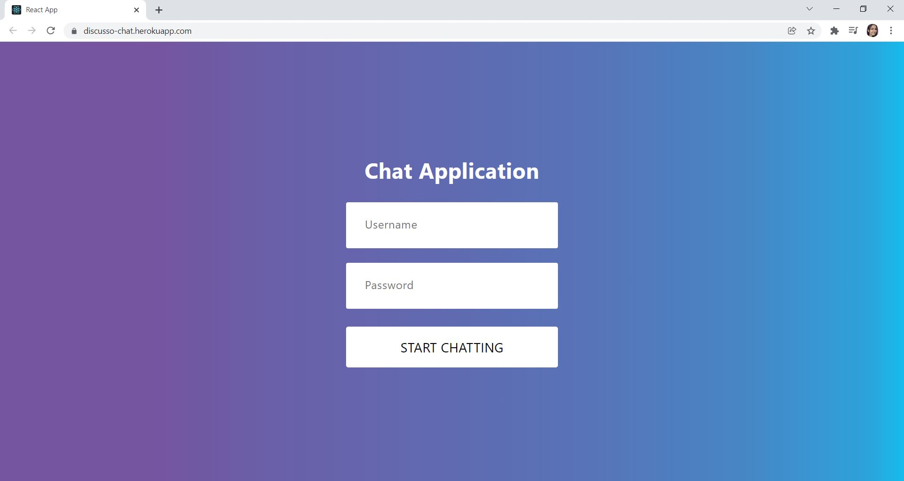
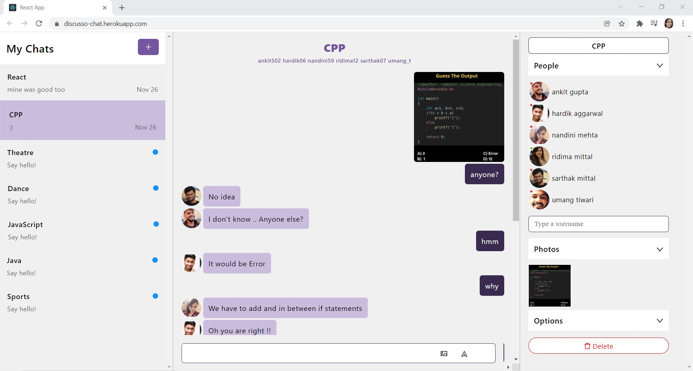
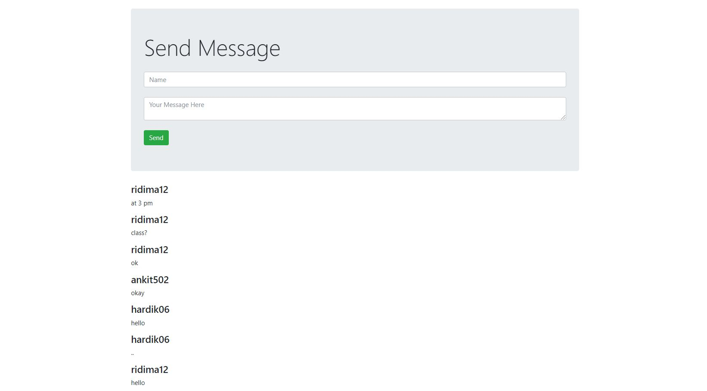

<h1 align="center">Discusso-React-Chat-Application
  
</h1>

 <a target="_blank" href="https://discusso-chat.herokuapp.com">Link to the App</a>
    ·
 <a target="_blank" href="https://www.youtube.com/watch?v=H88fwQiTvNE">Video Demo</a>

    
<!-- TABLE OF CONTENTS -->

  
Table of Contents

  <ol>
    <li>
      <a href="#about-the-project">About The Project</a>
      <ul>
        <li><a href="#salient-features">Salient Features</a></li>
        <li><a href="#compatible-platforms">Compatible Platforms</a></li>
        <li><a href="#built-with">Built With</a></li>
      </ul>
    </li>
    <li>
      <a href="#agile-methodology">Agile Methodology</a>
      <ul>
        <li><a href="#what-is-agile">What is Agile</a></li>
       </ul>
    </li>
    <li>
      <a href="#getting-started">Getting Started</a>
      <ul>
        <li><a href="#prerequisites">Prerequisites</a></li>
        <li><a href="#installation">Installation</a></li>
      </ul>
    </li>
    <li><a href="#navigating-through-the-app">Navigating through the App</a></li><ul>
        <li><a href="#login">Login</a></li>
      </ul>
    <li><a href="#resources-used">Resources Used</a></li>
  </ol>

<!-- ABOUT THE PROJECT -->

## About The Project
* Discusso is chat forum project built during Microsoft Engage 2021 program. 
* It is a chat application through which we can join, discover and create multiple communities of our interest.
* It is based on React, Chat engine, Node.js and MongoDb.

### Salient Features
* User authentication using username and secret provided by the administrator.
* Creating and deleting chat groups, adding and removing people by the group admin, media sharing, chat text formatting.
* Activity status of other users and sound notifications.

### Compatible Platforms
Laptops, Desktops and Tablet PCs

### Built With

**Front-end**     HTML, CSS, ReactJS, Ant-icons  
**Back-end**      NodeJS, Axios  
**Tools**         MongoDB  

<!-- AGILE METHODOLOGY -->
## Agile Methodology

### What is Agile

Agile is a development methodology adopted today in the software industry. Agile promotes teamwork, flexible procedures, and sle-organizing teams.

### How I Incorporated Agile Methodology During The Development Cycle

SCRUM is a subset of Agile, a framework for developing software. SCRUM takes advantage of different techniques to achieve goals in Agile. SCRUM promotes an iterative model where the planning is performed on a very short term. The basic time working unit is the sprint. SCRUM teams always reason in sprints and their planning is limited to sprints.

### Login-Page
  

### Chat Window

All the users registered with the app can be added to your chat. Photo sharing, read receipts, formatting the text, and many other things are possible in the chat. The shared photos can be viewed in the right pane. The chat can be deleted by expanding the 'Options' menu in the right pane and clicking the 'Delete' option.

  

### DataBase
   
  
 ## SAMPLE LOGIN CREDENTIALS   
 Username :  test123  
 Password :  123  
 

## Resources Used
* https://medium.com/swlh/node-js-creating-a-crud-api-with-node-js-15baca7985be#:~:text=%22start%22%3A%22node%20index.js%22%2C&text=After%20creating%20it%2C%20install%20all,mongoose%20%E2%80%94%20To%20connect%20with%20MongoDB.  
* https://chatengine.io/
